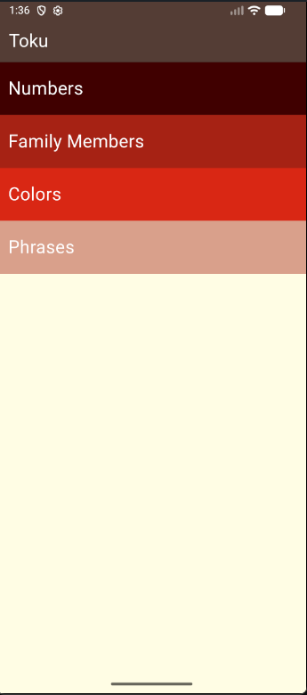
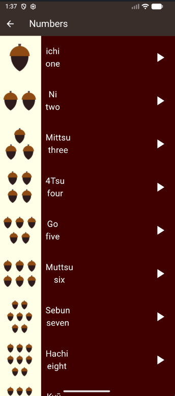
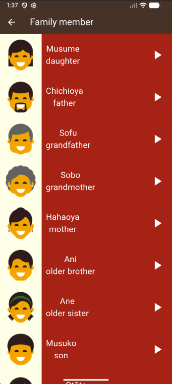
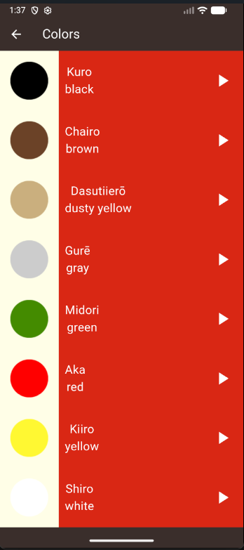
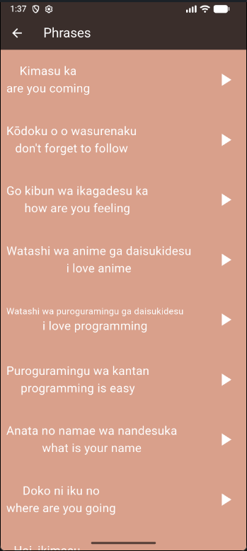

# Toku App 🇯🇵

An interactive Flutter application for learning basic Japanese vocabulary with images and audio pronunciation.

---

## 📱 Overview

**Toku** is a beginner-friendly Japanese learning app built using **Flutter**.  
It helps users learn essential Japanese words and phrases through clear categories, visuals, and correct pronunciation.

### Categories:
- Numbers (1–10)
- Family Members
- Colors
- Phrases

---

---

## 🎥 App Demo

This video demonstrates the app UI, navigation, and main features:

📹 **Demo Video:**  

https://github.com/user-attachments/assets 82acd0fb-7494-4316-893f-d9efeeba6226


---
## ✨ Features

- 🎨 Clean and simple UI
- 🔊 Audio pronunciation for every item
- 🖼️ Visual images for better memorization
- 📚 Well-organized learning categories
- 🚀 Smooth performance

---

## 📸 Screenshots

### Home Screen


### Numbers Page


### Family Members Page


### Colors Page


### Phrases Page


---

## 🛠️ Tech Stack

- **Flutter SDK:** ^3.10.1
- **Dart SDK:** ^3.10.1

### Dependencies

```yaml
dependencies:
  flutter:
    sdk: flutter
  cupertino_icons: ^1.0.8
  audioplayers: ^6.5.1
```

---

## 🎨 Assets Used

### Number Images (Acorns)
The app uses acorn icons to represent numbers 1-10:
- 🌰 Numbers are represented by groups of acorns
- Each acorn arrangement visually shows the quantity
- Makes learning more intuitive and fun

### Family Member Icons
Emoji-style icons represent different family members:
- 👧 Daughter
- 👨 Father
- 👴 Grandfather
- 👵 Grandmother
- 👩 Mother
- 👦 Older Brother
- 👧 Older Sister
- 👶 Son
- 🧒 Younger Brother
- 👧 Younger Sister

## 🚀 Installation and Running

1. **Clone the project**
```bash
git clone <repository-url>
cd toku_app
``` 

2. **Install dependencies**
```bash
flutter pub get
```

3. **Run the app**
```bash
flutter run
```

## 📖 How to Use

1. When you open the app, you'll see the home screen with four categories
2. Tap on any category to enter it
3. In each category, you'll find a list of items with:
   - The word in English
   - The word in Japanese
   - An illustrative image (for numbers, colors, and family members)
   - A play button to listen to the correct pronunciation
4. Tap the play button ▶️ to hear the pronunciation

## 🎨 Color Scheme

- **Numbers Page**: `#400101` (Dark Red)
- **Family Page**: `#A62014` (Red)
- **Colors Page**: `#D92818` (Light Red)
- **Phrases Page**: `#D9A08B` (Beige)
- **App Bar**: `#533D35` (Brown)
- **Home Background**: `#FFFDE4` (Light Yellow)
- **Content Background**: `#3B2E2C` (Dark Brown)

## 🔧 Future Enhancements

- Add new categories (animals, food, etc.)
- Add interactive quizzes
- Add progress tracking system
- Support additional interface languages
- Practice mode with spaced repetition
- Achievement system
- Offline mode optimization

## 📝 Notes

- The app uses the `audioplayers` library to play audio files
- All assets (images and sounds) must be present in the `assets` folder
- The app supports devices running Android and iOS
- All audio files are in .mp3 or .wav format
- Images follow a consistent style for better UX

## 🎯 Learning Content

### Numbers (1-10)
- One (ichi) - 一
- Two (Ni) - 二
- Three (Mittsu) - 三
- Four (4Tsu) - 四
- Five (Go) - 五
- Six (Muttsu) - 六
- Seven (Sebun) - 七
- Eight (Hachi) - 八
- Nine (Kyū) - 九
- Ten (Jū) - 十

### Sample Phrases
- "Are you coming?" - Kimasu ka
- "Don't forget to follow" - Kōdoku o o wasurenaku
- "How are you feeling?" - Go kibun wa ikagadesu ka
- "I love anime" - Watashi wa anime ga daisukidesu
- "What is your name?" - Anata no namae wa nandesuka

## 👨‍💻 Contributing

Contributions are welcome! If you'd like to improve the app:

1. Fork the project
2. Create a new feature branch (`git checkout -b feature/AmazingFeature`)
3. Commit your changes (`git commit -m 'Add some AmazingFeature'`)
4. Push to the branch (`git push origin feature/AmazingFeature`)
5. Open a Pull Request

## 📄 License

This project is for educational purposes.

## 🙏 Acknowledgments

- Audio files for Japanese pronunciation
- Icon assets for visual learning
- Flutter community for excellent documentation

---

**Made with ❤️ using Flutter**

*Learn Japanese the fun way! 🎌*
